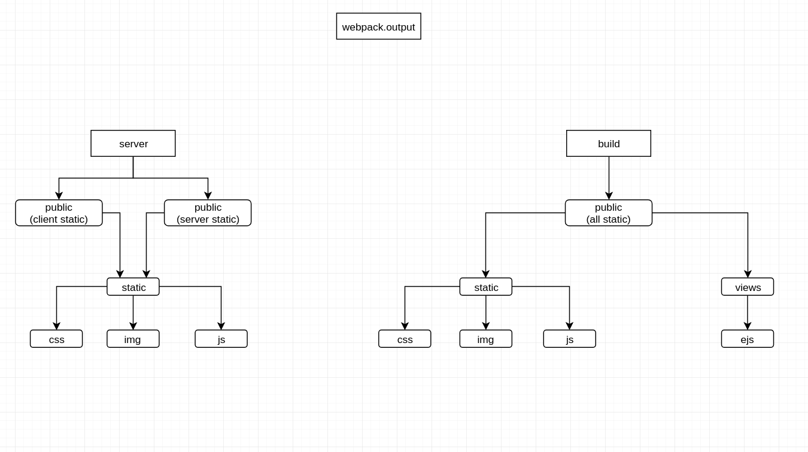

# 神游阅读器（fugueReader）

## 背景
没有背景就是为了玩
  
## webpack资源目录的架构图

## 中间件原理
对于koa的中间件的形容就是一根牙签穿透一整颗洋葱的过程，从外层进入，最后又从外层出去，牙签就是一个请求，洋葱的每一层就是中间件，请求会走过第一个中间件
_next_
前部分的代码，最后通过第一个中间件的
_next_
后部分的代码，具体可以查看[koa](https://github.com/koajs/koa/tree/master/lib)源码（大神的想法果然不一般）

## 更新说明
* 2020/11/02: 完成脚手架的基础搭建和文档说明
* 2020/11/03: 完成前后台的分级架构, 实现ejs的渲染中间件
* 2020/11/06: 集成element-admin
* 2020/11/10：集成文档生成、统一响应中间件、jwt验证（带有白名单）
* 2020/11/11：[apidoc](https://apidocjs.com/)的文档生成、读取项目中的.evn* 文件，设置全局的环境变量
* 2020/11/13：webpack打包结构修改、重写gulp的build任务
* 2020/11/16：抽出controller层
* 2020/11/27：servece层
* 2020/11/30：新增服务层404页面
* 2020/12/03：新增客户端ui框架cube-ui，新增px2rem适配插件
* 2020/12/11：新建表 重新爬取数据
* 2020/12/12：中间件发布成npm包
[webpack-dev-middleware-for-koa](https://github.com/tnnevol/webpack-dev-middleware-for-koa2)
[webpack-hot-middleware-for-koa2](https://github.com/tnnevol/webpack-hot-middleware-for-koa2)
[http-proxy-middleware-for-koa2](https://github.com/tnnevol/http-proxy-middleware-for-koa2)
* 2020/12/15：新增books层服务和接口

## 待完成
* 接口开发
* 客户端开发
* 书籍接口

## 注意
* 以防后期组件过多时编译过慢，采用接口模式和组件开发模式。接口模式不会编译任何组件，组件开始时不会重编译而是启用热更新
* 每一个model中都需要定义好主体信息，在定义接口时可以直接使用
* 项目是mvc的项目，server中的c层写在了router中，有时间再抽一下
* 项目中的中间件，可能仅仅适用于本项目，二次开发或者维护情自行了解koa中间件的封装
* 后期有时间可以研究一下vue的ssr，没时间就算了

## 维护
* 我可是靠心情维护项目的
  
## 技术
* vue-cli
* koa2
* node
* gulp
* webpack
* mongoDB